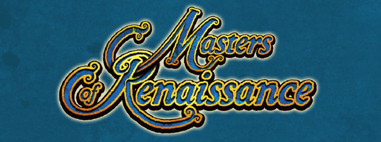

Final project for the Software Engineering course at Polytechnic of Milan, 2021.

## Group PSP42
- **[Bruno Morelli](https://github.com/BrunoMor99)** - bruno.morelli@mail.polimi.it
- **[Samuele Messineo](https://github.com/SamueleMessineo)** - samuele.messineo@mail.polimi.it
- **[Alberto Mosconi](https://github.com/albertomosconi)** - albertomaria.mosconi@mail.polimi.it

[//]: # (symbols ✔️ ✖️)

## Development progress
| Functionality | Status |
|--- | --- | 
|Basic rules|✔|
|Complete rules|✔️|
|Server|✔️|
|CLI|✔️|
|GUI|✖️|
|Persistence|✖️|
|Parameter editor|✖️|
|Offline games|✔️|
|Multiple games|✔️|
|Disconnection resilience|✔️|

## How to start

## Build

## Documentation and testing
