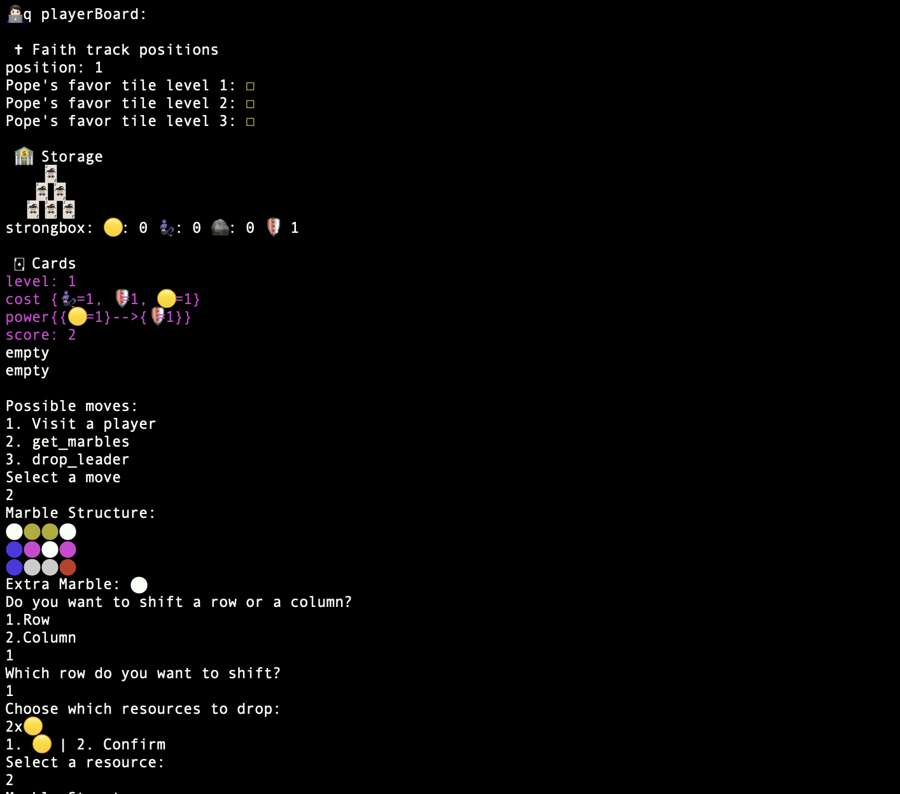

Final project for the Software Engineering course at Polytechnic of Milan, 2021.

**Teacher**: Pierluigi San Pietro

**Final Score**: 30/30 

## Group PSP42
- **[Bruno Morelli](https://github.com/BrunoMor99)** - bruno.morelli@mail.polimi.it
- **[Samuele Messineo](https://github.com/SamueleMessineo)** - samuele.messineo@mail.polimi.it
- **[Alberto Mosconi](https://github.com/albertomosconi)** - albertomaria.mosconi@mail.polimi.it

## Table of Contents
- [How to Start](#how-to-start "How to Start")
- [How to Play](#how-to-play "How to Play")
- [Development Progress](#development-progress "Development Progress")
- [Architecture](#architecture "Architecture")
- [Build](#build "Build")
- [Documentation and Testing](#documentation-and-testing "Documentation and Testing")
- [Screenshots](#screenshots "Screenshots")

## How to Start
This game can be played either online or offline. In order to play online you have to start the server using this command 
```
$ java -jar PSP42-server.jar
```
At this point the client can be started in two ways:
- **As CLI**
   ```
  $ java -jar PSP42-client.jar cli
  ```
- **As GUI (default)**
  ```
  $ java -jar PSP42-client.jar 
  ```
 
When playing online the user has to select the server ip address and the port. The port is 31415.

## How to Play
Once connected the player can choose to create a new game or join a game that has not yet started.

- **Create game**
      To create a new game the player must select his username, the number of players for the game and if it is a private game or not. If the game is
      private only the players with the roomId can join. The roomId is communicated to the game creator once he creates the game.
   
- **Join a Private game**
      To join a private game you have to enter your username and the gameId. The server will check if that username is already taken.
      
- **Join a Public game**
      To join a public game you just have to enter your username (again the server will check if that username is already taken) and the number of players
      of the game you want to join, if you select 0 you will join a random game.
      
- **Reconnect**
      If your connection went down or the server crashed you can rejoin a game by simply clicking on join a private game and reenter your past username and
      the roomId.

Once the game starts all the players will be asked to drop 2 leader cards and some players also to select which initial resources they want to start the game with, according to the rules of the game.
When everyone has finished their selection the players will be brought to the main board.

- **Main Board**
      In the main board the players can see all of their playerboards, the market and all the faith tracks. A player can see other players boards by 
      tapping on the interested player in the top tab pane in the gui or selecting the "visit a player" move and writing the player's username in the cli.
      During the player's turn the moves he can perform glow in the gui and are listed in the cli.
      
- **Playing with the GUI**
      Every UI element has a move associated. The moves that the current player can perform correspond to the glowing elements. To perform a move the user has to click on the UI element corresponding to the move and then the UI will zoom on that element and a button with the name of the move will appear.  
      By clicking on the button the move will start, some moves like buying a card will be automatically performed once the user clicks on the card, or the element of interest, others like activating the productions will need the user to confirm the move after selecting the productions he wants to activate.
      
## Development Progress
| Functionality | Status |
|--- | --- | 
|Basic rules|✔️|
|Complete rules|✔️|
|Server|✔️|
|CLI|✔️|
|GUI|✔️|
|Persistence|✔️|
|Offline games|✔️|
|Multiple games|✔️|
|Disconnection resilience|✔️|
|Parameter editor|✖️|

## Architecture

This game has been realized using an MVC arhitecture. Model and controller are kept server-side while the view in user-side and they interact by exchanging messages. Each message is handled in a scalable way by the use of the Visitor pattern.

The server checks if the users are still connected using ping-pong messages, if after sending a ping message the server does not receive a pong message in 10 seconds the user is considered disconnected. Users can reconnect any time to the server.

The server stores all the unfinished games allowing players to resume old games at any time, even if the server rebooted.

## Build

Before building make sure you have at least Java version 11 installed by running this command
```
$ java --version
openjdk 11.x ...
```
The maven command line is also required. To run tests and compile the jar files yourself run this command
```
$ cd ing-sw-2021-morelli-messineo-mosconi/
$ mvn package
...
```
The jar files will be created in `./deliverables/final/jar/`.

Alternatively you can open the project with IntelliJ IDEA and build it from there.

## Documentation and Testing

We have acheived the following coverages for the `model` and `controller` packages.

### Model Tests Coverage
|Element |Class |Method |Line |
---|---|---|---|
Market|83%|80%|87%|
Player|92%|91%|88%|
Shared|100%|92%|89%|
Game|100%|90%|91%|

### Controller Tests Coverage
|Element |Class |Method |Line |
---|---|---|---|
ClassicGameController|100%|84%|88%|
SoloGameController|66%|80%|70%|

In addition, extensive beta testing has been done to test the `view` and `network` packages.

## Screenshots

### GUI
<details>
  <summary>Click to expand!</summary>

  

  

  

  

  

  

  

  
</details>

### CLI
<details>
  <summary>Click to expand!</summary>

  

  

  

  

</details>
