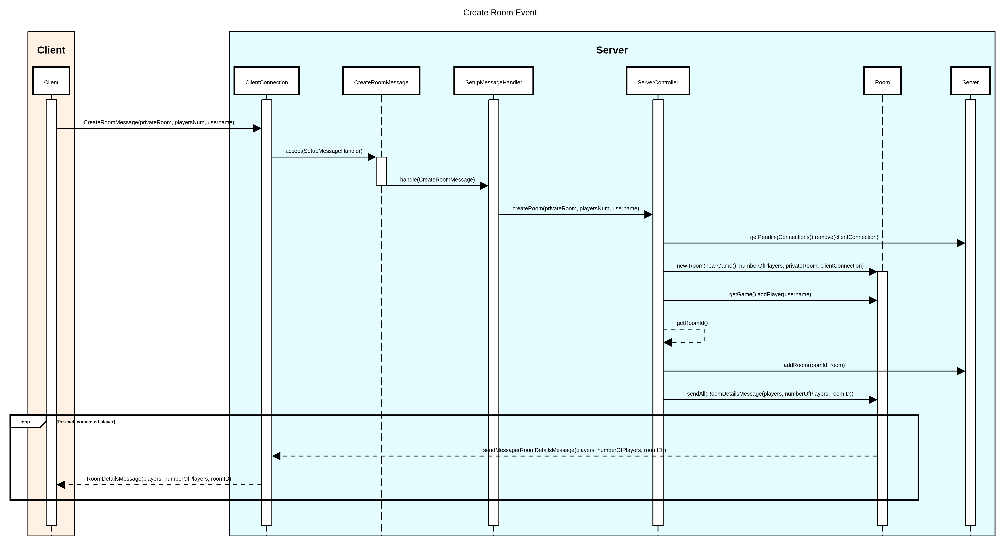
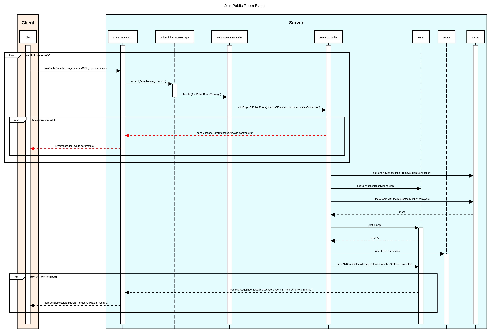
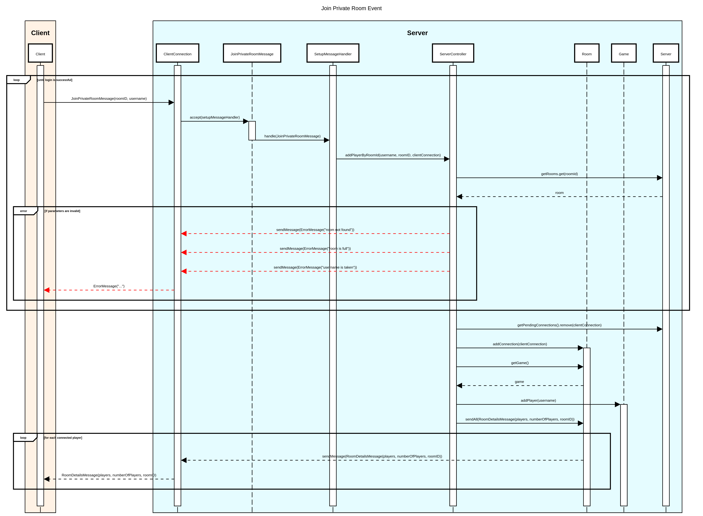
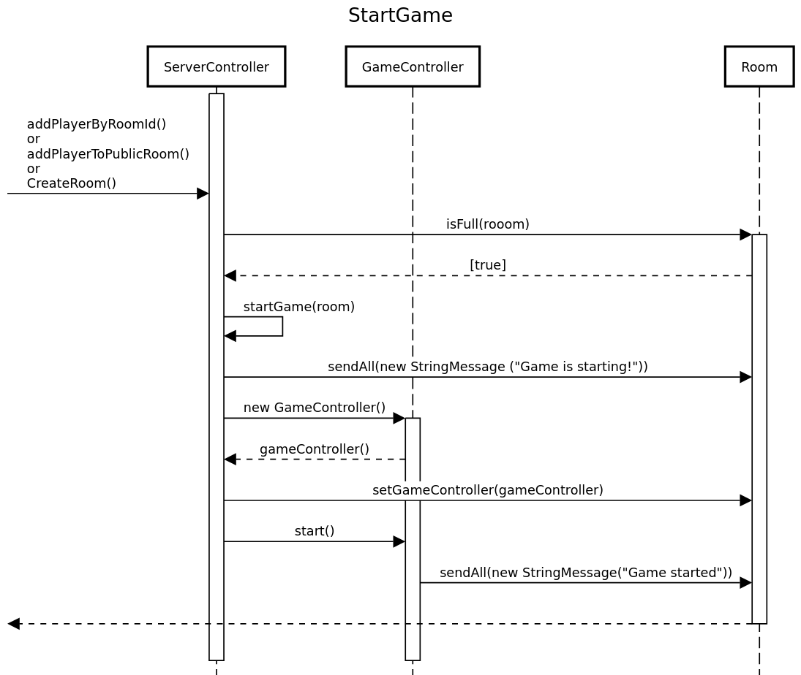
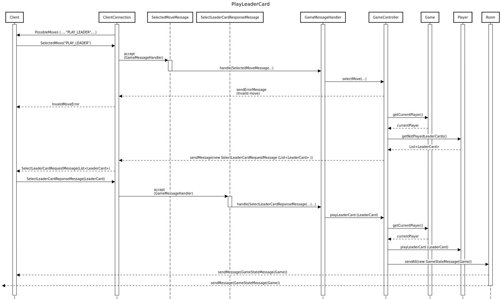
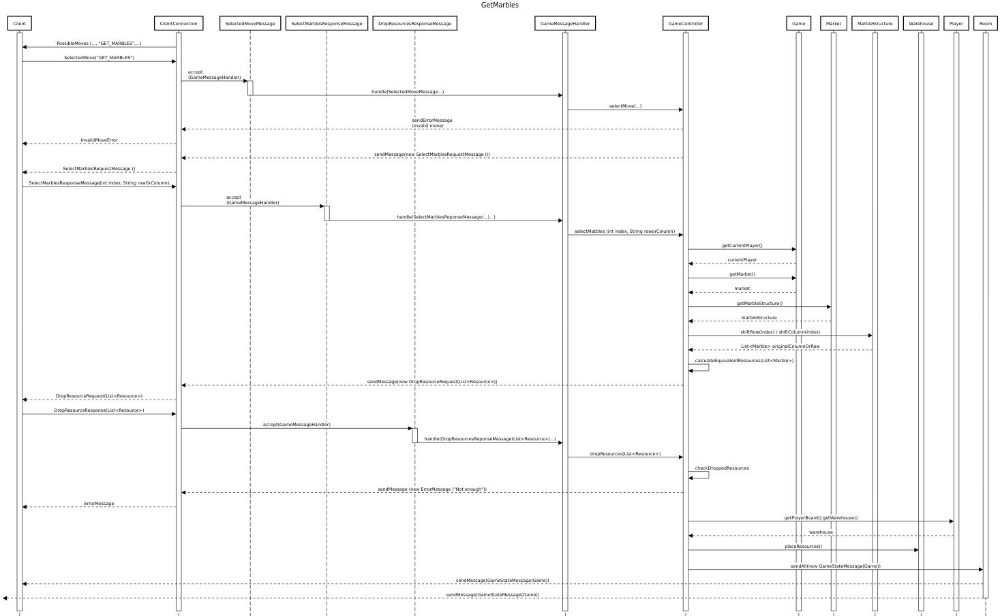

# Network Protocol

The game uses a **message-based** network protocol. Below are listed various events, along with their **sequence diagrams**.

- [Create Room](#create-room-event)
- [Join Public Room](#join-public-room-event)
- [Join Private Room](#join-private-room-event)
- [Start Game](#start-game-event)
- [Play Leader Card](#play-leader-card-event)
- [Get Marbles](#get-marbles-event)

## Create Room Event

## Join Public Room Event

## Join Private Room Event

## Start Game Event

## Play Leader Card Event

## Get Marbles Event

