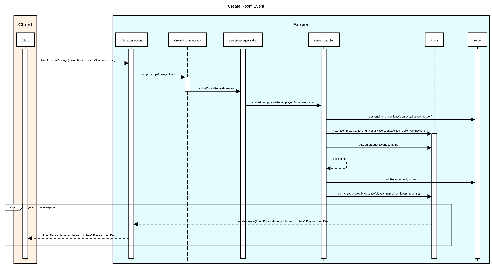
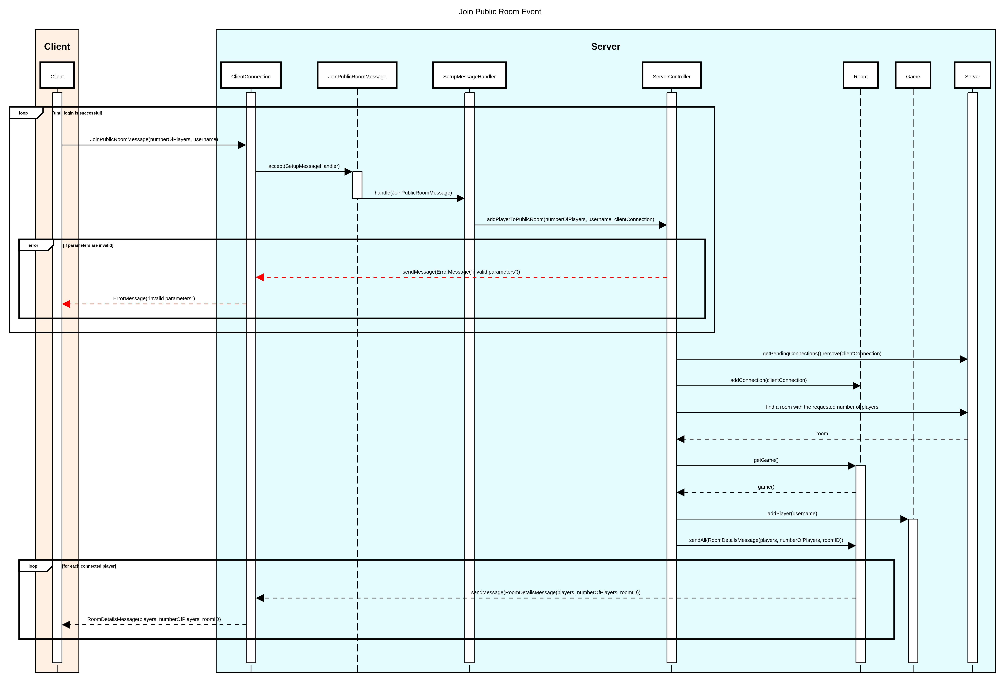
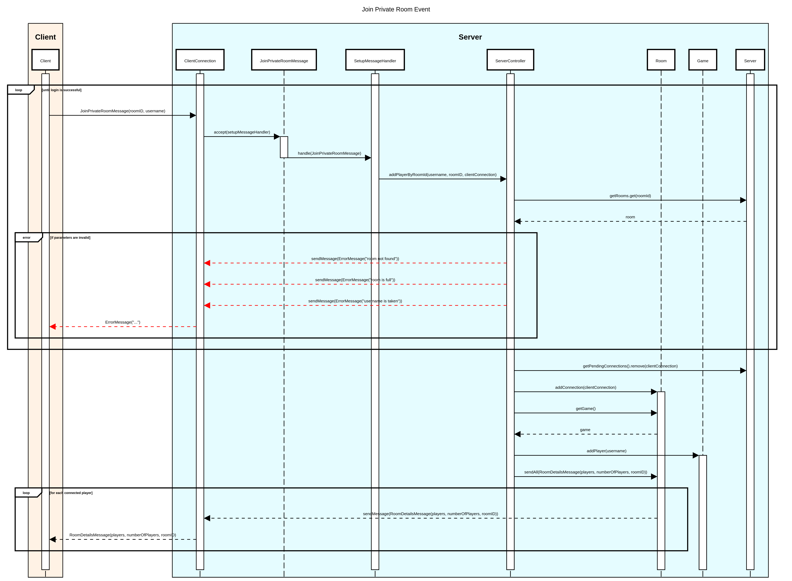
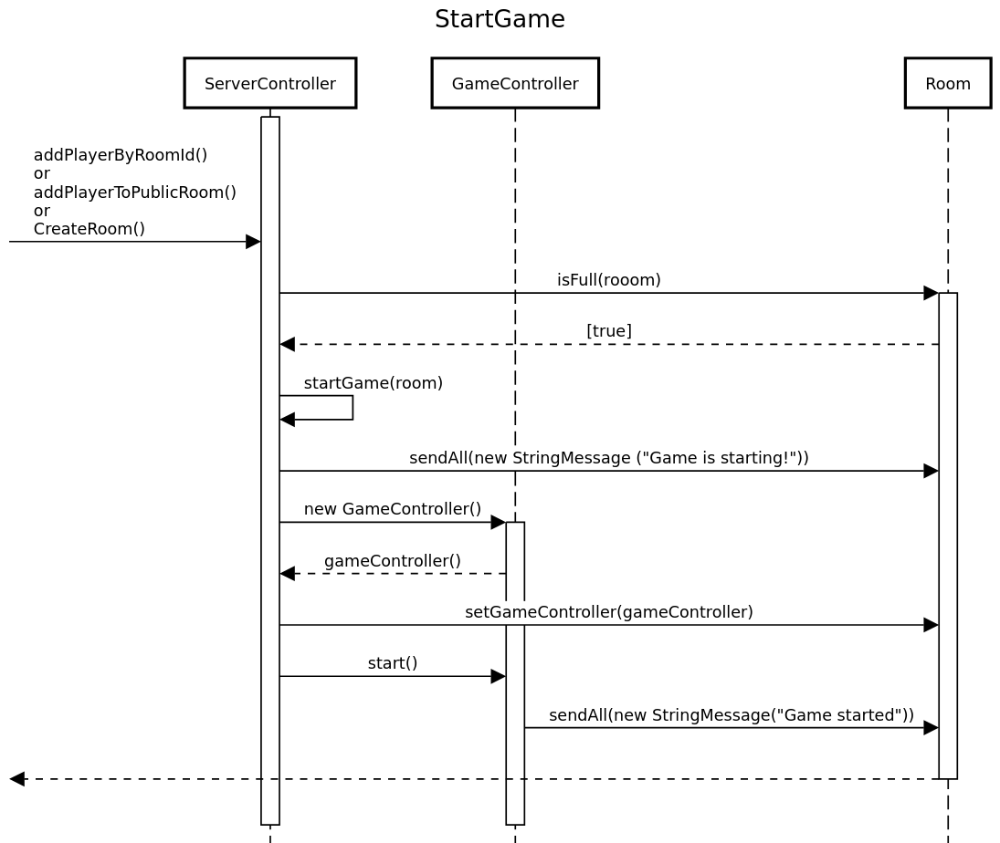
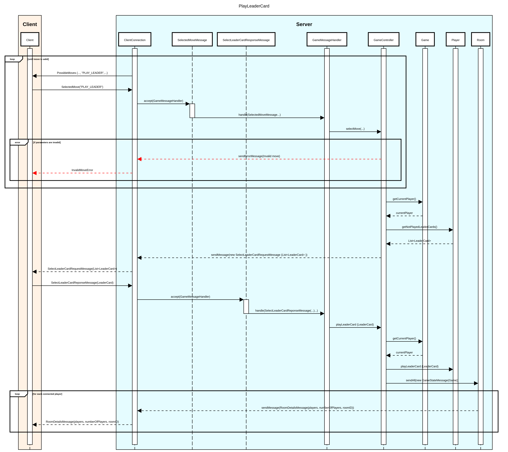

# Network Protocol

The game uses a **message-based** network protocol. Below are listed various events, along with their **sequence diagrams**.

- [Create Room](#create-room-event)
- [Join Public Room](#join-public-room-event)
- [Join Private Room](#join-private-room-event)
- [Start Game](#start-game-event)
- [Play Leader Card](#play-leader-card-event)
- [Get Marbles](#get-marbles-event)

## Create Room Event

When the game starts, the user can choose to create a new room and make it private or public. Private means only other players that have the room's ID can join, whereas a public room allows anyone to join if they select the same number of players.

## Join Public Room Event

The user can join a public room by specifying the number of players and his username. When a new player joins all the others in that same room receive a RoomDetaisMessage containing the updated list of players.

## Join Private Room Event

The user can join a private room by entering the RoomID generated when a room is created, and his username.

## Start Game Event

When the last player joins a room, a message is sent to all the connected clients signaling the beginning of the game.

## Play Leader Card Event

When a player chooses to play a leader card, and it is a valid move, the server sends back only the leader cards that are playable (the ones whose requirements are all met). The user then selects one of these and the server notifies all the players with the updated game details.

## Get Marbles Event

When a players wants to obtain resources from the marble structure, the server requests the selection of a row and column. It then sends the resources corresponding to the user's selection, requesting that he discards some of them. The remaining resources are placed on the shelves, and all the players in the room receive the updated game details.

